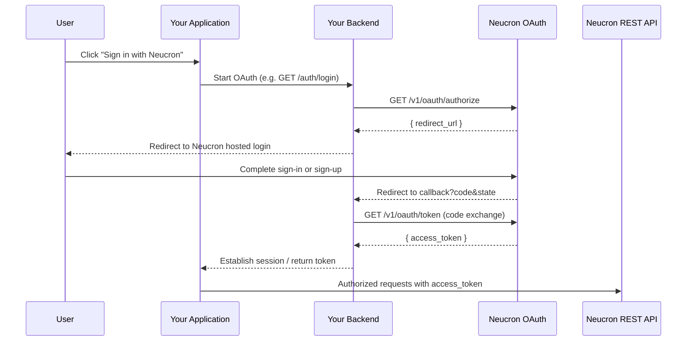

# Sign in with Neucron (OAuth 2.0 Authorization Code)

This guide shows how to add **Sign in with Neucron** to any application using the `@neucron/ts-sdk`. The flow is stack-agnostic — adapt the route names and session storage to your framework (Express, Next.js, NestJS, Django, etc.).

---

## Overview

Sign in with Neucron authenticates users with their Neucron account and returns an **access token** your application uses as a bearer credential for Neucron REST APIs.

Your application:

1. Redirects the user to Neucron for authentication.
2. Receives an authorization `code` on your registered callback URL.
3. Exchanges the code for an `access_token` on the **server** (client secret never leaves the backend).
4. Stores the token and uses it for authorized Neucron API calls.

---

## OAuth flow



---

## Prerequisites

- Access to the Neucron developer / OAuth console
- An OAuth client registered for your platform / app
- A publicly reachable (or locally tunneled) redirect URI
- A backend that can hold `client_secret` securely
- Test users granted access to your platform on Neucron

---

## Register your OAuth application

1. Open the Neucron OAuth / developer console.
2. Create an OAuth application.
3. Set the platform / app name (e.g. `YourApp`). This **must match** the `platform` parameter you send in the authorize request.
4. Copy the **Client ID** and **Client Secret**.
5. Register exact redirect URIs, for example:
   - Development: `https://localhost:3000/auth/callback`
   - Production: `https://your-domain.com/auth/callback`

`redirect_uri` must match **exactly** (scheme, host, port, path) in:

- the Neucron console registration
- the authorize request
- the token exchange request

---

## SDK setup

Install the SDK:

```bash
npm install @neucron/ts-sdk
```

Store credentials in environment variables (never expose `client_secret` to the browser):

```bash
NEUCRON_CLIENT_ID=<from Neucron console>
NEUCRON_CLIENT_SECRET=<from Neucron console>
NEUCRON_API_BASE_URL=https://dev.neucron.io/v1
OAUTH_REDIRECT_URI=https://your-domain.com/auth/callback
PLATFORM_NAME=YourApp
```

Create a shared SDK instance with OAuth defaults:

```typescript
import NeucronSDK, { generateOAuthState } from '@neucron/ts-sdk';

export const sdk = new NeucronSDK({
  baseUrl: process.env.NEUCRON_API_BASE_URL,
  oauth: {
    clientId: process.env.NEUCRON_CLIENT_ID,
    clientSecret: process.env.NEUCRON_CLIENT_SECRET,
    redirectUri: process.env.OAUTH_REDIRECT_URI,
    platform: process.env.PLATFORM_NAME,
  },
});

export { generateOAuthState };
```

### SDK OAuth methods

| Method | Endpoint | Purpose |
| --- | --- | --- |
| `sdk.oauth.authorize()` | `GET /oauth/authorize` | Returns `{ redirect_url }` for hosted login |
| `sdk.oauth.exchangeToken()` | `GET /oauth/token` | Exchanges `code` for `{ access_token }` and stores token on `sdk.auth` |
| `generateOAuthState()` | — | Generates a random CSRF `state` value |

After `exchangeToken()`, call any protected SDK method — for example `sdk.auth.userInfo()`.

---

## Backend implementation

### 1. Start login — `GET /auth/login`

```typescript
import { sdk, generateOAuthState } from './neucron.js';

export async function startOAuthLogin(req, res) {
  const state = generateOAuthState();

  // Persist state in session / signed cookie for CSRF validation on callback
  req.session.oauthState = state;

  const { data } = await sdk.oauth.authorize({
    state,
    flow: req.query.flow === 'sign-up' ? 'sign-up' : 'sign-in',
    client_id: process.env.NEUCRON_CLIENT_ID!,
    redirect_uri: process.env.OAUTH_REDIRECT_URI!,
    platform: process.env.PLATFORM_NAME!,
  });

  res.redirect(data.redirect_url);
}
```

When OAuth defaults are configured on the SDK instance, you can omit `client_id`, `redirect_uri`, and `platform` from each call.

### 2. Handle callback — `GET /auth/callback`

```typescript
export async function handleOAuthCallback(req, res) {
  const { code, state } = req.query;

  if (!code || typeof code !== 'string') {
    return res.status(400).send('Missing authorization code');
  }

  if (!state || state !== req.session.oauthState) {
    return res.status(400).send('Invalid OAuth state');
  }

  const { data } = await sdk.oauth.exchangeToken({
    code,
    state,
    client_id: process.env.NEUCRON_CLIENT_ID!,
    client_secret: process.env.NEUCRON_CLIENT_SECRET!,
    redirect_uri: process.env.OAUTH_REDIRECT_URI!,
  });

  // Token is already stored on sdk.auth; persist session as needed
  req.session.accessToken = data.access_token;
  delete req.session.oauthState;

  res.redirect('/dashboard');
}
```

### 3. Session endpoint — `GET /auth/me`

```typescript
export async function getSession(req, res) {
  const token = req.session.accessToken;
  if (!token) {
    return res.json({ authenticated: false });
  }

  sdk.auth.setToken(token);
  const { data: user } = await sdk.auth.userInfo();

  return res.json({ authenticated: true, token, user });
}
```

### 4. Logout — `POST /auth/logout`

```typescript
export function logout(req, res) {
  req.session.destroy(() => {
    sdk.auth.logout();
    res.json({ ok: true });
  });
}
```

---

## Frontend integration

### Sign-in button

Use a full-page redirect (not XHR alone) so the browser can follow Neucron’s hosted login redirects:

```typescript
function signInWithNeucron(flow: 'sign-in' | 'sign-up' = 'sign-in') {
  window.location.href = `/auth/login?flow=${encodeURIComponent(flow)}`;
}
```

### Post-login bootstrap

On app load:

1. Call `GET /auth/me` with `credentials: 'include'`.
2. If authenticated, hydrate user profile and app data from Neucron APIs.

---

## API usage after login

The access token works as the `Authorization` header for Neucron REST APIs:

```typescript
sdk.auth.setToken(accessToken);

const { data: user } = await sdk.auth.userInfo();
const { data: businesses } = await sdk.business.getBusinessList();
const { data: wallets } = await sdk.wallet.walletList();
```

Typical hydration after sign-in:

- `GET /auth/user/info`
- Load businesses / teams
- Resolve roles / permissions
- Load product-specific resources (wallets, assets, etc.)

---

## Flows: sign-in vs sign-up

Both use the same authorize → callback → token exchange pipeline. Pass `flow: 'sign-in'` or `flow: 'sign-up'` to `sdk.oauth.authorize()` — only the hosted UI path differs.

---

## Security guidelines

- **Never** expose `client_secret` to browsers, mobile binaries, or public repos.
- Always use **HTTPS** in production for authorize, callback, and token exchange.
- Generate a random `state` per login attempt and verify it on callback (CSRF protection). Use `generateOAuthState()` from the SDK.
- Prefer **httpOnly, Secure, SameSite=Lax** cookies for browser sessions.
- Keep redirect URI allowlists tight.
- On logout, clear both server session cookies and any client-stored tokens.
- Treat the access token as opaque; do not rely on client-side JWT decoding for authorization decisions.

---

## Verification checklist

- [ ] OAuth app created; platform name matches `platform` param
- [ ] Client ID and secret configured on the server only
- [ ] Redirect URI registered and identical in authorize + token steps
- [ ] `sdk.oauth.authorize()` returns `redirect_url`; browser reaches Neucron hosted login
- [ ] After login, callback receives `code` and `state`
- [ ] `sdk.oauth.exchangeToken()` returns `access_token`
- [ ] Session is established (cookie / store)
- [ ] Authenticated API call succeeds (e.g. `sdk.auth.userInfo()`)
- [ ] Logout clears the session completely

---

## Reference

### Endpoints

| Step | Method | Path |
| --- | --- | --- |
| Authorize | `GET` | `/v1/oauth/authorize` |
| Token exchange | `GET` | `/v1/oauth/token` |

### Authorize parameters

`response_type`, `client_id`, `redirect_uri`, `state`, `platform`, `flow`

### Token parameters

`grant_type=authorization_code`, `code`, `redirect_uri`, `client_id`, `client_secret`, `state`

### Platform name

`platform` is project-specific. Register it in the Neucron console and send the same string from your login handler. Do not reuse another application’s platform name.

---

## MCP tools (optional)

If you use the Neucron MCP server, equivalent tools are available:

| MCP Tool | SDK equivalent |
| --- | --- |
| `neucron_oauth_authorize` | `sdk.oauth.authorize()` |
| `neucron_oauth_exchange_token` | `sdk.oauth.exchangeToken()` + `sdk.auth.userInfo()` |

---

*Neucron OAuth 2.0 Authorization Code — Sign in with Neucron. Applicable to any application stack.*
